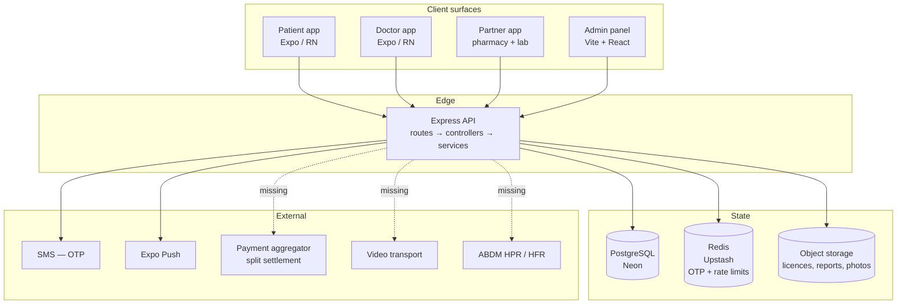
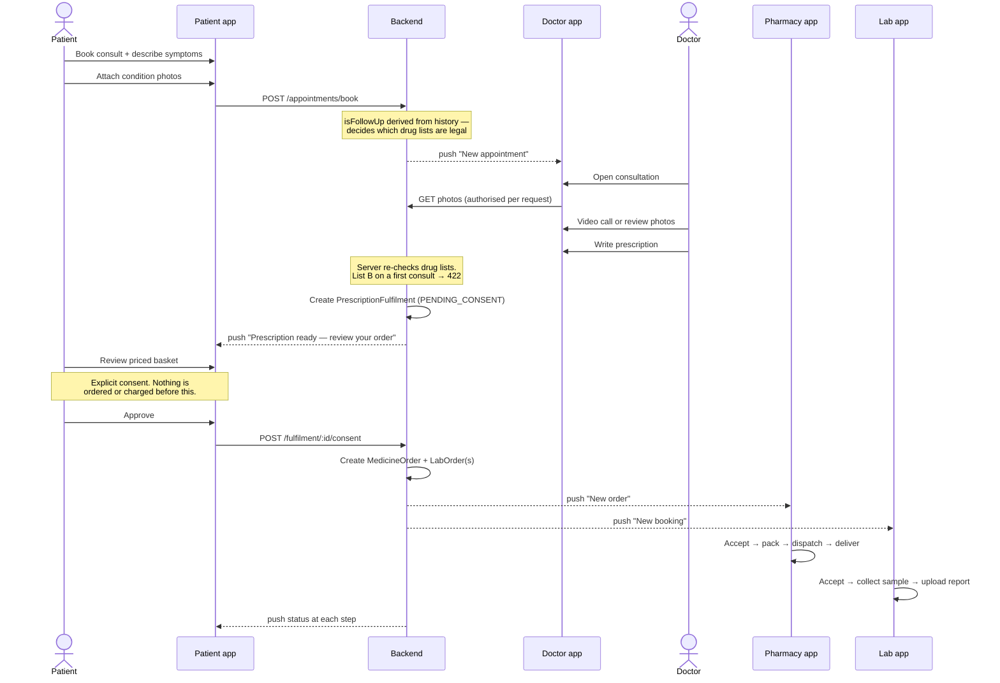
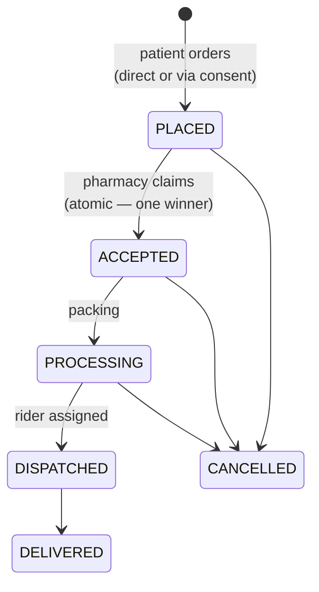
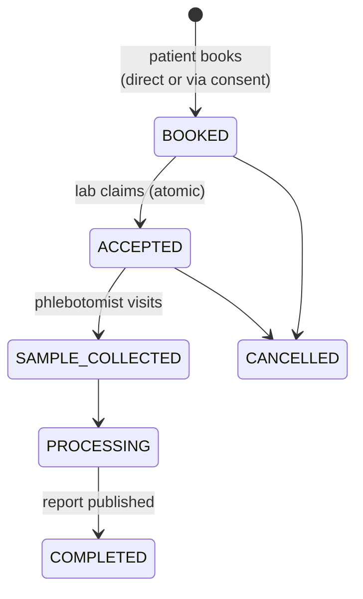
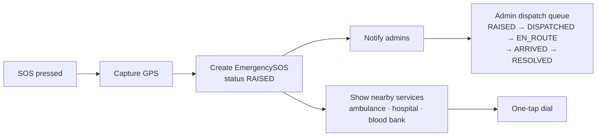
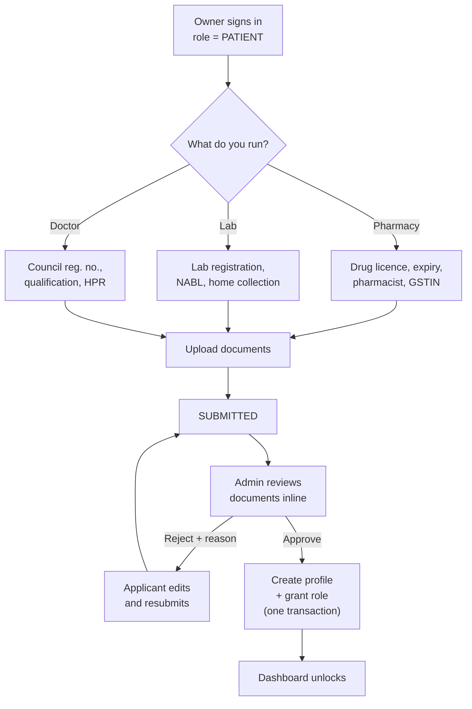

# Health Buddy — infrastructure map

What the platform is, who uses it, how work flows between them, and exactly
what stands between here and launch.

Legend used throughout: **[built]** · **[building]** · **[missing]** ·
**[blocked]** (needs an account or decision from you, not code).

---

## 1. The product in one line

A patient consults a doctor by video or by photo, the doctor prescribes, and —
**with the patient's explicit consent** — the medicines and lab tests order
themselves and route to a nearby verified pharmacy and lab.

Everything else exists to make that sentence true safely.

---

## 2. Actors and surfaces

| Actor | Surface | Ships as |
| --- | --- | --- |
| Patient | `mobile/apps/patient` | Health Buddy |
| Doctor | `mobile/apps/doctor` | Health Buddy Doctor |
| Pharmacy owner | `mobile/apps/partner` (pharmacy mode) | Health Buddy Partner |
| Lab owner | `mobile/apps/partner` (lab mode) | *same binary* |
| Platform admin | `admin/` | Web panel |
| Delivery rider | *future app* | **[missing]** |
| Ambulance operator | *future app* | **[missing]** |

Pharmacy and lab share one binary because their workflow *shape* is identical —
queue → accept → progress → complete. They diverge at the navigator, not inside
every screen. Rider and ambulance are deliberately deferred: the order models
already carry `assignedAgentUserId`, so those apps slot in without a migration.

---

## 3. System topology



**[built]** API, PostgreSQL, Redis, SMS, push.
**[built]** Object storage — one driver serves Cloudflare R2 and S3, since R2
speaks the S3 API. Local disk remains for development and is refused in
production.
**[built]** Payments behind a provider interface: `mock` simulates the whole
flow offline, `razorpay` uses Route so the *licensed* aggregator holds and
splits the money. **[blocked]** going live needs your aggregator account.
**[built]** Video behind a provider interface: `mock`, `jitsi`, `daily` — all
three hand back a URL a browser opens, so they work in Expo Go.
**[blocked]** ABDM registry checks — needs sandbox credentials you hold.

---

## 4. The core journey: consult → prescribe → auto-order

This is the automation that makes the product more than a directory.



**Why consent is a hard gate.** Auto-ordering medicine the moment a doctor
prescribes would mean charging a patient for something they never agreed to buy,
possibly from a pharmacy they didn't choose, at a price they never saw. The
prescription is clinical advice; the purchase is a separate decision. So the
fulfilment sits in `PENDING_CONSENT` showing a priced basket, and expires
untouched if ignored.

Status: **[building]** — see §9.

---

## 5. Journey: medicine order → doorstep



Guard on `DISPATCHED`: an order containing prescription-only medicine cannot
leave the shop without a prescription attached. Enforced server-side.

`assignedAgentUserId` carries the rider today (partner staff) and a dedicated
rider app later.

---

## 6. Journey: lab test → report



Reports are **private documents**, not URLs. Readable only by the patient, the
lab that produced them, a doctor with a real consultation relationship, or an
admin — and every read is written to the audit log.

---

## 7. Journey: emergency SOS



**[built]** SOS capture, admin dispatch queue with live coordinates.
**[building]** the area-aware services directory and one-tap dial.

Calling a real ambulance is a phone call, not an API — the honest design surfaces
the right number fast rather than pretending to dispatch a vehicle.

---

## 8. Journey: provider onboarding (the security spine)



**The invariant:** an application is a *request*. `ProviderApplication.type`
picks a form and a dashboard and is never consulted for authorisation. Only
`reviewApplicationService` — admin-only — creates the profile and changes
`User.role`. This is the boundary that the original privilege-escalation bug
broke, and it has six regression tests guarding it.

---

## 9. Build status by capability

### Built and verified

| Capability | Where |
| --- | --- |
| Phone + OTP auth, typed JWTs, refresh re-reads role | `src/services/authService.ts` |
| Provider self-registration → admin verification → role grant | `applicationService.ts` |
| Private document storage, authorised per request | `documentService.ts`, `utils/storage.ts` |
| Doctor availability, slot generation | `doctorService.ts` |
| Atomic booking / order claim / lab claim | `appointment`, `pharmacy`, `lab` services |
| Telemedicine drug lists + Schedule X blocking | `prescriptionService.ts` |
| Per-partner inventory and lab pricing | `inventoryService.ts` |
| Push + in-app notification feed | `notificationService.ts` |
| Audit log of privileged actions | `auditService.ts` |
| Licence expiry tracking + auto-suspension | `applicationService.ts` |
| Admin panel: review, users, emergency, audit | `admin/src/pages/` |
| Prescription → order with patient consent | `fulfilmentService.ts` |
| Image-based consultation | `documentService.ts` |
| Condition-matched health notifications | `healthContentService.ts` |
| Emergency services directory (public) | `emergencyDirectoryService.ts` |
| Checkout, split settlement, refunds, COD | `paymentService.ts`, `payment/provider.ts` |
| Object storage on R2 / S3 | `utils/storage.ts` |
| Video room minting + join authorisation | `videoService.ts` |
| Stock ledger, reservations, expiry control | `stockService.ts` |
| Uniform lab pricing by area | `inventoryService.ts` |

### Stock: a ledger, not a number

```
PharmacyInventory.stock  ── running total, never edited directly
PharmacyInventory.reserved ── promised to paid orders, not yet dispatched
                sellable = stock − reserved

every change is a StockMovement carrying a reason:
  PURCHASE · RETURN            → adds
  SALE_OFFLINE · EXPIRED · DAMAGED → removes
  CORRECTION                   → whatever reconciles a recount
  SALE_ONLINE · ORDER_CANCELLED → system, on dispatch and cancellation
```

A bare editable number cannot answer "we are 40 boxes short, what happened?",
and in a pharmacy that question is the job. Reserving rather than deducting is
what keeps the shelf count honest between payment and dispatch — the units are
still physically there, they are just no longer sellable to anyone else.

### Lab pricing: set by area, not by the lab

```
LabOffering   ── which tests a lab CAN run, and how fast (the lab's choice)
LabTestPrice  ── what a test COSTS in an area (the platform's choice)

resolution: state+city → state → national → LabPackage.price
```

A patient cannot judge sample handling the way they can judge a restaurant, so
letting labs undercut each other selects for the cheapest handling rather than
the best. One price per test per area means labs compete on turnaround and
accreditation instead.

### Money: how a payment flows

```
patient approves a basket, picks a method
        │
   ┌────┴────┐
  COD      prepaid
   │          │
   │     PaymentSplit legs computed in integer paise;
   │     the platform takes the REMAINDER so the legs
   │     always sum to exactly what is charged
   │          │
   │     aggregator collects, holds and splits
   │          │
   │     signed handoff OR signed webhook  ← the only
   │          │                              things that
   │          │                              mark it PAID
   └────┬─────┘
        ▼
  orders leave PENDING_PAYMENT and reach partner queues
```

Two invariants: **no client can mark its own order paid**, and **the platform
never custodies partner money** — the second is what keeps this outside RBI
payment-aggregator authorisation.

### Blocked on your accounts

| Capability | What it needs from you |
| --- | --- |
| **Payments going live** | A Razorpay account with Route enabled, and each partner onboarded as a linked account. Code is done; set `PAYMENT_PROVIDER=razorpay` plus the three keys. |
| **Video going live** | A Daily API key (~10,000 free participant-minutes/month) or your own Jitsi deployment. `meet.jit.si` works today but makes the first participant sign in with Google/GitHub/Facebook. |
| **ABDM registry checks** | Sandbox credentials for HPR (doctors) and HFR (facilities). IDs are already captured and shown to reviewers. |
| **SMS in production** | A provider account. `SMS_PROVIDER=mock` is rejected in production. |
| **Object storage going live** | An R2 bucket plus an API token. Keep the bucket private — do not enable the `r2.dev` public URL. |

### Missing — operational, no external dependency

| Gap | Impact |
| --- | --- |
| Prisma **migrations** (currently `db push`) | No rollback path on a live database |
| **CI** | Nothing runs the 59 tests automatically |
| **Error tracking** (Sentry) | You would learn about failures from users |
| **Pagination** on ~33 list queries | `getDoctorAppointments` returns every appointment ever |
| **Frontend tests** | 0 across 90 app source files |
| **DPDP compliance**: consent records, retention policy, data export/delete | Legal requirement, not a feature |
| i18n | English-only limits reach sharply in India |

---

## 10. Future surfaces

Both are already anticipated in the data model, so neither needs a migration:

**Delivery rider app.** `MedicineOrder.assignedAgentUserId` exists. A rider app
would consume assigned orders, update status, and capture proof of delivery.
Until then partner staff self-assign.

**Ambulance operator app.** `EmergencySOS` already has status transitions and
coordinates. An operator app would claim a request and stream location. Until
then the admin panel dispatches and the patient dials directly.

---

## 11. Recommended launch order

1. ~~Consent automation~~ · ~~payments~~ · ~~storage~~ · ~~video~~ — **done**, all
   behind provider interfaces so switching from mock to live is configuration
2. **Turn on the real providers**: R2 credentials, a Razorpay account with Route,
   a Daily key or your own Jitsi host, an SMS provider
3. **Onboard each partner as a linked account** — until a partner has a
   `payoutAccountId`, their share is recorded as owed but stays in the platform's
   settlement rather than being split out
4. **Migrations + CI + Sentry** — roughly a day, and it makes everything else safe to change
5. **Pagination** — before onboarding beyond a handful of providers
6. Rider app → ambulance app → i18n

Launching without 2 and 4 means a platform that cannot take money and cannot
tell you when it breaks.

---

## 12. Production cutover

The development credentials are fine while the database holds seeded fixtures.
The trigger to replace them is **the first real patient record**, not launch day
— a pilot with five real users is enough to make it matter.

Work through this in order. Nothing here is optional once real people are on it.

### Credentials — all new, none reused

| What | Where | Why it cannot be reused |
| --- | --- | --- |
| `JWT_ACCESS_SECRET` / `JWT_REFRESH_SECRET` | `openssl rand -hex 32` | **Reuse them and a token minted on a laptop is valid in production.** Rotate these even if you keep everything else |
| `DATABASE_URL` / `DIRECT_URL` | A new Neon project, not a new password on the old one | The dev database holds test patients; you do not want them in the same instance as real records |
| `REDIS_*` | A new Upstash database | Holds OTPs and rate-limit state |
| R2 token | A new token scoped to a **production bucket** | Keeps dev uploads out of the bucket holding real licences |

Rotating a JWT secret signs every existing session out. Do it during the
cutover, not afterwards.

### Configuration that must change

```
NODE_ENV=production
EXPOSE_DEV_OTP=false        # returns the OTP in the response — catastrophic live
SMS_PROVIDER=twilio|msg91   # "mock" delivers nothing
PAYMENT_PROVIDER=razorpay   # "mock" marks orders paid without collecting
STORAGE_DRIVER=r2           # "local" is wiped on every redeploy
VIDEO_PROVIDER=daily|jitsi
CORS_ORIGINS=https://…      # explicit list, no wildcard
```

The app refuses to boot if any of these is still set to a development value
while `NODE_ENV=production`. That check is deliberate — every one of them fails
silently and expensively rather than loudly.

### Before the first real user

- **Prisma migrations**, not `db push`. There is no rollback from `db push` on a
  database with real records in it
- **Sentry or equivalent**, or you find out about failures from patients
- **`npm run storage:check`** against the production bucket
- A **restore test**: take a backup, restore it somewhere, confirm it works.
  An untested backup is a hope, not a backup
- Confirm the R2 bucket is still private — `storage:check` covers this
- **Set `TZ=Asia/Kolkata`** on the server. Slot times are stored as local
  `HH:mm`, so a server on UTC opens a 10:00 consultation at the wrong hour

### Regulatory, before taking money or prescribing

- Razorpay Route live mode, with each partner onboarded as a linked account
- Retention and deletion policy under the DPDP Act, plus a way for a patient to
  export and delete their record
- The video provider's data-processing terms — `meet.jit.si` is not an
  appropriate host for clinical calls at any real volume
