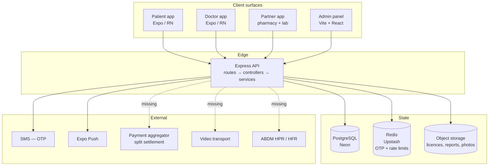
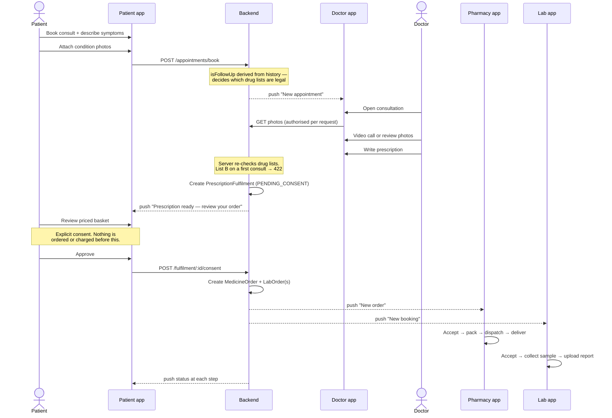
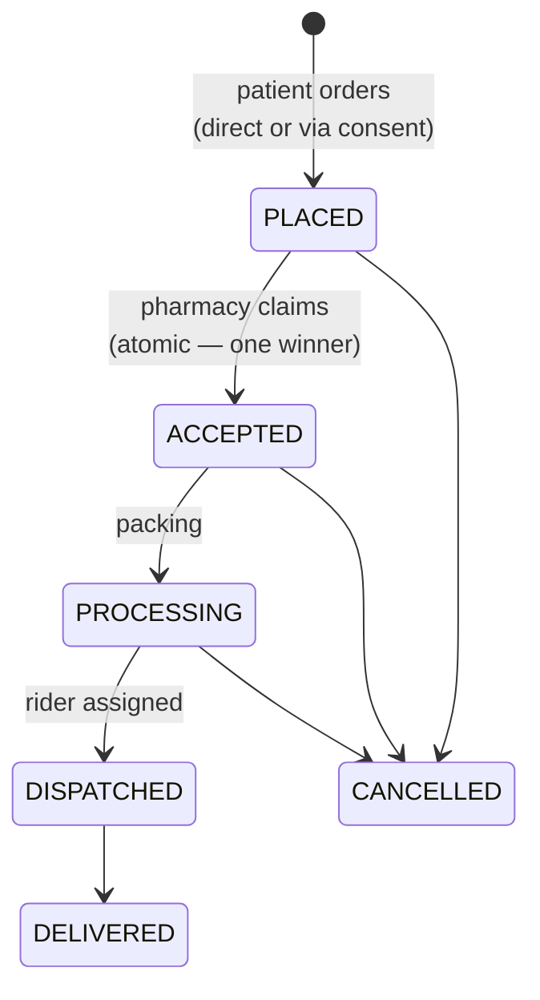
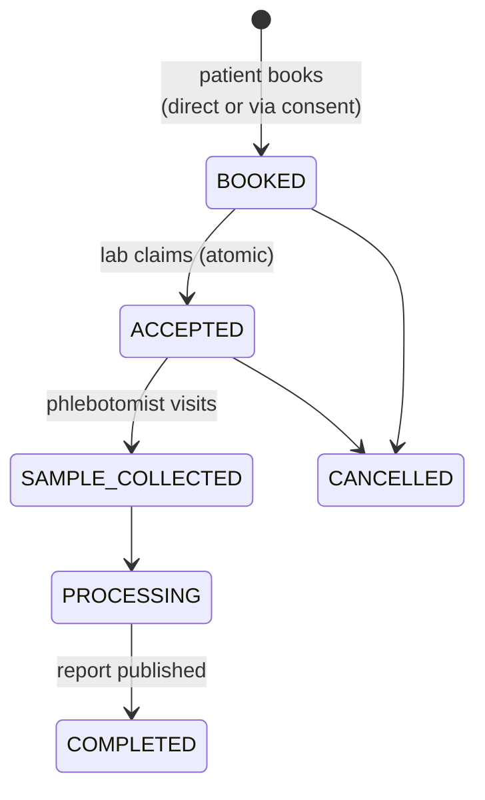
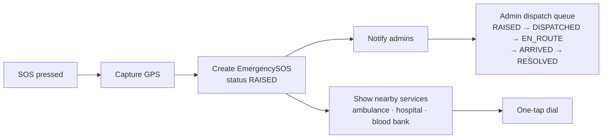
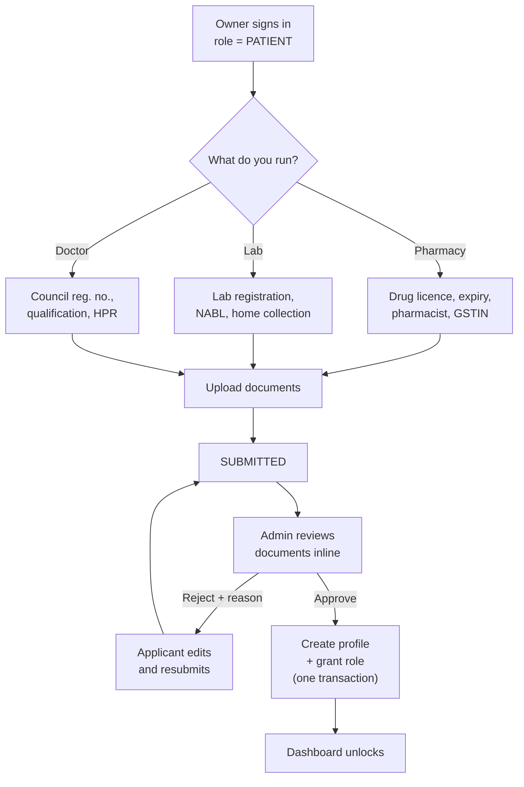

# Health Buddy — infrastructure map

What the platform is, who uses it, how work flows between them, and exactly
what stands between here and launch.

Legend used throughout: **[built]** · **[building]** · **[missing]** ·
**[blocked]** (needs an account or decision from you, not code).

---

## 1. The product in one line

A patient consults a doctor by video or by photo, the doctor prescribes, and —
**with the patient's explicit consent** — the medicines and lab tests order
themselves and route to a nearby verified pharmacy and lab.

Everything else exists to make that sentence true safely.

---

## 2. Actors and surfaces

| Actor | Surface | Ships as |
| --- | --- | --- |
| Patient | `mobile/apps/patient` | Health Buddy |
| Doctor | `mobile/apps/doctor` | Health Buddy Doctor |
| Pharmacy owner | `mobile/apps/partner` (pharmacy mode) | Health Buddy Partner |
| Lab owner | `mobile/apps/partner` (lab mode) | *same binary* |
| Platform admin | `admin/` | Web panel |
| Delivery rider | *future app* | **[missing]** |
| Ambulance operator | *future app* | **[missing]** |

Pharmacy and lab share one binary because their workflow *shape* is identical —
queue → accept → progress → complete. They diverge at the navigator, not inside
every screen. Rider and ambulance are deliberately deferred: the order models
already carry `assignedAgentUserId`, so those apps slot in without a migration.

---

## 3. System topology

**[built]** API, PostgreSQL, Redis, SMS, push.
**[built]** Object storage *interface* — local-disk driver works, S3 driver is a
deliberate stub that throws rather than silently degrading. **[missing]** the S3
implementation.
**[blocked]** payments, video, ABDM — each needs an account you hold.

---

## 4. The core journey: consult → prescribe → auto-order

This is the automation that makes the product more than a directory.

**Why consent is a hard gate.** Auto-ordering medicine the moment a doctor
prescribes would mean charging a patient for something they never agreed to buy,
possibly from a pharmacy they didn't choose, at a price they never saw. The
prescription is clinical advice; the purchase is a separate decision. So the
fulfilment sits in `PENDING_CONSENT` showing a priced basket, and expires
untouched if ignored.

Status: **[building]** — see §9.

---

## 5. Journey: medicine order → doorstep

Guard on `DISPATCHED`: an order containing prescription-only medicine cannot
leave the shop without a prescription attached. Enforced server-side.

`assignedAgentUserId` carries the rider today (partner staff) and a dedicated
rider app later.

---

## 6. Journey: lab test → report

Reports are **private documents**, not URLs. Readable only by the patient, the
lab that produced them, a doctor with a real consultation relationship, or an
admin — and every read is written to the audit log.

---

## 7. Journey: emergency SOS

**[built]** SOS capture, admin dispatch queue with live coordinates.
**[building]** the area-aware services directory and one-tap dial.

Calling a real ambulance is a phone call, not an API — the honest design surfaces
the right number fast rather than pretending to dispatch a vehicle.

---

## 8. Journey: provider onboarding (the security spine)

**The invariant:** an application is a *request*. `ProviderApplication.type`
picks a form and a dashboard and is never consulted for authorisation. Only
`reviewApplicationService` — admin-only — creates the profile and changes
`User.role`. This is the boundary that the original privilege-escalation bug
broke, and it has six regression tests guarding it.

---

## 9. Build status by capability

### Built and verified

| Capability | Where |
| --- | --- |
| Phone + OTP auth, typed JWTs, refresh re-reads role | `src/services/authService.ts` |
| Provider self-registration → admin verification → role grant | `applicationService.ts` |
| Private document storage, authorised per request | `documentService.ts`, `utils/storage.ts` |
| Doctor availability, slot generation | `doctorService.ts` |
| Atomic booking / order claim / lab claim | `appointment`, `pharmacy`, `lab` services |
| Telemedicine drug lists + Schedule X blocking | `prescriptionService.ts` |
| Per-partner inventory and lab pricing | `inventoryService.ts` |
| Push + in-app notification feed | `notificationService.ts` |
| Audit log of privileged actions | `auditService.ts` |
| Licence expiry tracking + auto-suspension | `applicationService.ts` |
| Admin panel: review, users, emergency, audit | `admin/src/pages/` |

### Building now

| Capability | Why it matters |
| --- | --- |
| Prescription → order with patient consent | The automation the product is built around |
| Image-based consultation | Half of consults don't need video |
| Condition-based health notifications | Retention, and genuinely useful |
| Emergency services directory | Makes the SOS page actionable |

### Missing — blocked on your decisions

| Capability | What it needs from you |
| --- | --- |
| **Payments** | A licensed payment aggregator account with split settlement (Razorpay Route / Cashfree Easy Split). You must not custody funds — that requires RBI authorisation. |
| **Video consultation** | A WebRTC provider (Agora, 100ms, Twilio Video, Daily). All need an account and a native dev build; none work in Expo Go. |
| **ABDM registry checks** | Sandbox credentials for HPR (doctors) and HFR (facilities). IDs are already captured and shown to reviewers. |
| **SMS in production** | A provider account. `SMS_PROVIDER=mock` is rejected in production. |
| **Object storage** | An S3-compatible bucket. Driver is stubbed to throw rather than lose files silently. |

### Missing — operational, no external dependency

| Gap | Impact |
| --- | --- |
| Prisma **migrations** (currently `db push`) | No rollback path on a live database |
| **CI** | Nothing runs the 38 tests automatically |
| **Error tracking** (Sentry) | You would learn about failures from users |
| **Pagination** on ~33 list queries | `getDoctorAppointments` returns every appointment ever |
| **Frontend tests** | 0 across 90 app source files |
| **DPDP compliance**: consent records, retention policy, data export/delete | Legal requirement, not a feature |
| i18n | English-only limits reach sharply in India |

---

## 10. Future surfaces

Both are already anticipated in the data model, so neither needs a migration:

**Delivery rider app.** `MedicineOrder.assignedAgentUserId` exists. A rider app
would consume assigned orders, update status, and capture proof of delivery.
Until then partner staff self-assign.

**Ambulance operator app.** `EmergencySOS` already has status transitions and
coordinates. An operator app would claim a request and stream location. Until
then the admin panel dispatches and the patient dials directly.

---

## 11. Recommended launch order

1. **Finish the consent automation** — it is the product's differentiator
2. **Payments** — no revenue without it
3. **Migrations + CI + Sentry** — roughly a day, and it makes everything else safe to change
4. **S3 driver** — before any real licence document is uploaded
5. **Pagination** — before onboarding beyond a handful of providers
6. **Video** — a scheduled call with a phone fallback covers a surprising amount
7. Rider app → ambulance app → i18n

Launching without 2 and 3 means a platform that cannot take money and cannot
tell you when it breaks.
